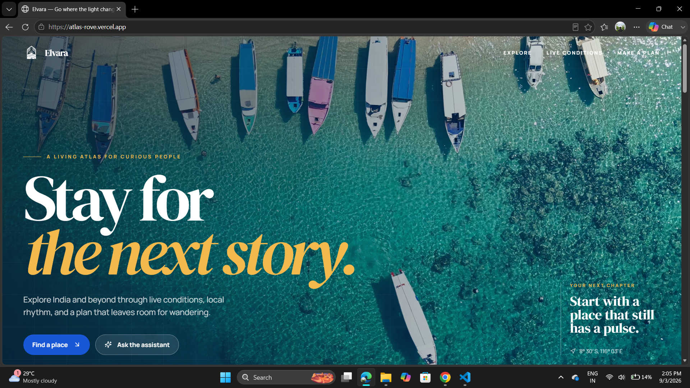
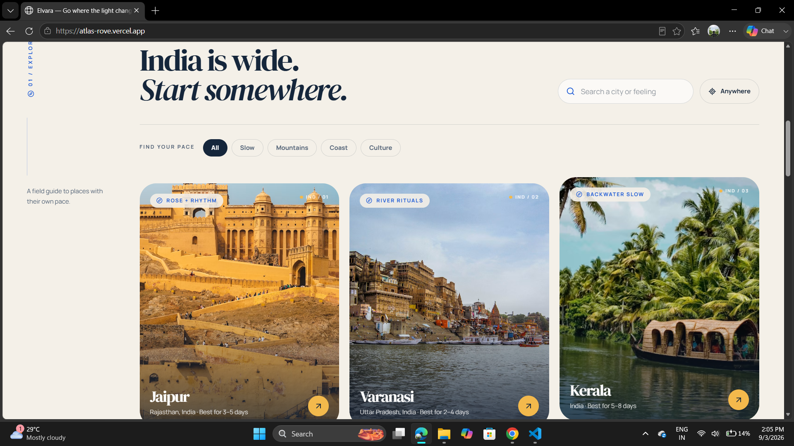
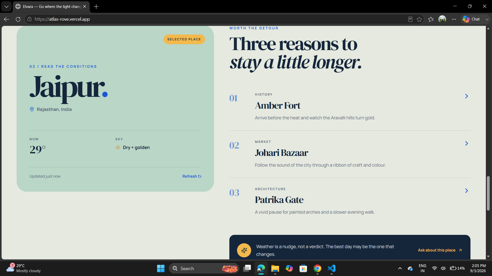

# 🌍 Elvara – Travel Explorer

> A modern and interactive travel exploration website designed to help users discover destinations, explore travel experiences, and create personalized trip itineraries.

## 🚀 Live Demo

🔗 **[View Elvara Live](https://atlas-rove.vercel.app/)**

## 📌 About The Project

**Elvara** is a modern travel exploration and trip-planning web application built to provide users with a simple, visual, and interactive way to discover destinations across India.

The website allows users to explore destinations, search and filter locations based on travel preferences, view destination information and weather details, and interact with a Trip Assistant to create a personalized travel itinerary.

## ✨ Key Features

* 🔎 **Destination Search** – Quickly search for specific destinations.
* 🏔️ **Travel Mood Filters** – Filter destinations based on preferences such as Slow, Mountains, Coast, and Culture.
* 📍 **Location Awareness** – Uses browser location functionality for a more personalized experience.
* 🌤️ **Weather Information** – Displays weather and temperature information for selected destinations.
* 🗺️ **Destination Details** – Explore recommended places and experiences for each destination.
* 🤖 **Trip Assistant** – Interact with the travel assistant based on your preferred travel style.
* 📅 **Personalized Itinerary** – Generate a structured 3-day travel plan.
* 🎨 **Modern UI/UX** – Clean, responsive, and visually engaging travel-focused design.
* ✨ **Interactive Animations** – Smooth transitions, hover effects, and interactive elements.
* 📱 **Responsive Design** – Designed to work across different screen sizes.

## 🖥️ Screenshots

### 🏠 Home Page


### 🔍 Explore Page


### 📍 Destination Page


## 🛠️ Technologies Used
* **React**
* **TypeScript**
* **Vite**
* **Tailwind CSS**
* **CSS**
* **Lucide React**
* **Google Maps Integration**

## 📂 Project Structure

```text
src/
├── components/
│   └── ui/
├── pages/
│   └── Home.tsx
├── App.tsx
├── Map.tsx
├── index.css
└── main.tsx
```

## ⚙️ Installation & Setup

Clone the repository:

```bash
git clone <your-github-repository-url>
```

Navigate to the project directory:

```bash
cd atlas-rove
```

Install dependencies:

```bash
npm install
```

Start the development server:

```bash
npm run dev
```

The application will then be available on the local development server.

## 🎯 Project Highlights

The main highlight of Elvara is the combination of **destination discovery and personalized trip planning** in a single platform.

Instead of only displaying destination information, the application provides an interactive experience where users can search for destinations, select their preferred travel mood, explore recommended places, check weather information, and use the Trip Assistant to generate a structured itinerary.

## 🔮 Future Improvements

* Integration with real-time travel APIs
* Live Google Maps and route planning
* Hotel and flight recommendations
* More advanced AI-powered trip planning
* User accounts and saved trips
* Trip sharing functionality
* Multi-language support

## 👨‍💻 Author

**Kishor Kumar**

Built with ❤️ using React, TypeScript, and modern web technologies.

---

⭐ If you like this project, consider giving the repository a star!
